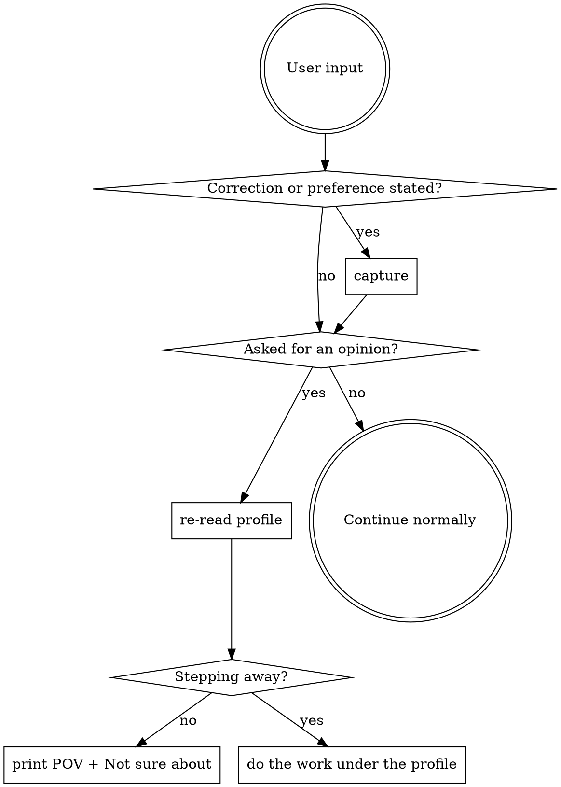

# Patternscribe

## Overview

This project keeps a profile of how its owner wants work done, learned from what they
corrected in past sessions. The profile lives at `<data_dir>/PATTERNS.md`, the evidence
behind it at `<data_dir>/journal.md`, and `<data_dir>` is `.patternscribe/` unless the config
says otherwise.

Most of the time the profile maintains itself: a hook analyses each finished session in
the background. This skill is for the parts that need a live agent — capturing a
correction the moment it happens, explaining why a rule exists, and giving an opinion
grounded in the profile rather than in generic best practice.

**Core principle:** learn before you advise. An opinion that ignores the correction the
user gave two minutes ago is worse than no opinion, because it sounds informed.

## When to Use

- The user corrects you and you want it to stick → **capture**
- "How would I have done this?" / "What do you think?" / "Is this the right approach?"
  → **suggest**
- "Take it from here" / they are stepping away mid-task → **lead**
- "What have you learned?" → **show**
- "Why do you keep doing X?" → **why**
- "Stop doing X" / "that rule is wrong" → **forget**
- Session start reported unanalysed sessions → **capture** (drains the queue)
- Anything about the model, runner, superpowers toggle or where data lives → **config**
- Hooks not firing, nothing being learned → **doctor**

Do not use this skill to look up project conventions — those live in the project's own
context file and do-don't skills. This is only for preferences learned from behaviour.

## Paths

Resolve everything through the config rather than assuming a layout:

```bash
PLUGIN_LIB="<this skill's plugin>/lib"
python3 "$PLUGIN_LIB/config.py" show          # merged settings
python3 "$PLUGIN_LIB/config.py" path data     # <data_dir>
python3 "$PLUGIN_LIB/config.py" path state    # <data_dir>/state
bash "$PLUGIN_LIB/bootstrap.sh"               # create them if missing (idempotent)
```

## Before you edit the profile

This section applies to the commands below, which run in a live session. It does not
apply to the background distiller: that runs with a deliberately minimal tool set and
cannot invoke a skill at all, so it always follows the inlined checklist.

If `use_superpowers` is true and the superpowers skills are available, invoke
`superpowers:writing-skills` before rewriting `PATTERNS.md`, and
`superpowers:verification-before-completion` before reporting done.

If it is true but superpowers is not installed here, mention how to install it for this
host — once per session, not every time.

If it is false, or superpowers is not available, follow this instead. It is the same
discipline, inlined so this plugin stands alone:

1. Read the current `PATTERNS.md` in full before changing a line of it.
2. Write each bullet as an instruction someone could act on, not as an observation
   about the user.
3. After writing, re-read what you wrote and delete anything that is true of every
   project rather than this one.
4. State plainly what you changed. If you changed nothing, say that.

## capture — `/patternscribe`

Distil the session you are in right now. Use it the moment the user corrects you, rather
than hoping the session-end hook catches it later.

1. Run `bash "$PLUGIN_LIB/bootstrap.sh"`.
2. Read `<data_dir>/PATTERNS.md`.
3. Work from the conversation you are in — you do not need the transcript file, you were
   there. Identify what the user corrected, refused, or restated, and ask of each one:
   *would this apply to a different task?* If not, it is not a pattern.
4. Apply the merge rules in `references/patterns-format.md`. They are not optional; the
   counter discipline is what makes the file trustworthy.
5. Append the evidence to `<data_dir>/journal.md`.
6. If the session-start hook reported pending sessions, also read
   `<data_dir>/state/queue`, distil each listed session's digest the same way, and clear
   the file.
7. Report what changed in one line.

## suggest — `/patternscribe suggest`

Give your point of view, grounded in what this user actually wants.

1. Run **capture** first, in full. Do not skip it because the session feels
   uneventful — the correction you are about to reason from may be from ten minutes ago.
2. Re-read the refreshed `PATTERNS.md`.
3. Look at what is actually in front of you: the current task, the diff
   (`git diff`, `git diff --staged`), the files under discussion.
4. Print this and change nothing:

```
How you'd have done this
  - <the approach the profile implies, concretely>
Where the current approach diverges
  - <specific conflict>  (rule: "<the rule>", seen Nx)
What I'd do instead
  - <actionable steps>
Not sure about
  - <where the profile is silent, so this part is my opinion, not theirs>
```

The last section is not optional. Without it, a guess is indistinguishable from a
learned preference, and the user cannot tell which parts to trust.

If the profile is empty or silent on everything that matters here, say so directly —
"nothing learned about this yet, so this is just my read" — and give the opinion anyway.

## lead — `/patternscribe lead`

Same two learning steps as **suggest**, then do the work instead of printing about it.
Before starting, state in one or two lines which rules you are working under, so the
user can see the basis when they come back. Stop and ask if the profile is silent on a
decision that would be expensive to reverse.

## show — `/patternscribe show`

Print `PATTERNS.md`, highest counts first. Note how many sessions it was built from
(the header) and where the file is, so the user can edit it by hand.

## why — `/patternscribe why <text>`

Search `<data_dir>/journal.md` for the rule and show the dated evidence: what was said,
when, in which session. If the rule is in `PATTERNS.md` but has no journal entry, say so
— it was probably hand-written, which is worth knowing.

## forget — `/patternscribe forget <text>`

1. Show the user the exact bullet you are about to remove and its evidence.
2. Remove it from `PATTERNS.md` and add a dated "removed" entry to `journal.md` saying
   the user asked for it.
3. If they want it gone permanently, re-add it under `## Archive` marked `(pinned)`
   with `do not re-learn` — pinned bullets are never rewritten, so it cannot come back.

## config — `/patternscribe config`

Run `python3 "$PLUGIN_LIB/config.py" show`, explain the resolved values, and edit
`<project>/.patternscribe/config.json` when asked. That file holds only overrides; anything
absent falls back to the plugin's `config.default.json`. See `references/runners.md`
before changing the `runner` block.

## doctor — `/patternscribe doctor`

Report, in this order, stopping at the first thing that is broken:

- config resolution and data dir — `python3 "$PLUGIN_LIB/config.py" show`
- whether the host has a transcript adapter (automatic capture needs one; the manual
  commands do not)
- resolved model — `python3 "$PLUGIN_LIB/config.py" resolve-model`, and whether
  `state/needs-config` exists
- last run — `tail -20 <data_dir>/state/distill.log`
- queue depth and `state/analyzed` line count
- whether `state/lock` is stale (a directory left behind by a killed run; safe to
  `rmdir` if no distiller is running)

## Red Flags

These thoughts mean stop — you are about to make the profile worse:

| Thought | Reality |
|---|---|
| "I'll add this rule, it might be useful" | A rule nobody asked for is noise that outranks real ones. |
| "This is close enough to an existing rule, I'll add it anyway" | Near-duplicates are how this file dies. Increment the count. |
| "I'll give my opinion first and capture afterwards" | Then the opinion ignores the correction you just got. |
| "The session was quiet, nothing to capture" | Fine — say "no new patterns". Do not invent one. |
| "I'll record that they wanted invoice.py fixed" | That is a task, not a pattern. |
| "The profile is stale, I'll rewrite it properly" | Rewriting drops counts and pins. Merge, never replace. |
| "This rule is obviously right, it can outrank a pin" | Pinned means a person decided. You do not overrule that. |
| "I'll note the API key so I remember the setup" | Never. Secrets, file contents and personal data stay out. |
| "The project's context file already says this, but restating helps" | It is already in front of every session. Skip it. |

## Decision flow



## References

- `references/patterns-format.md` — the file contract: sections, counters, pins, decay,
  and the merge rules. Read before any edit to `PATTERNS.md`.
- `references/runners.md` — pointing the background distiller at a different CLI or a
  different model.
- `references/host-tools.md` — tool-name differences across hosts.
